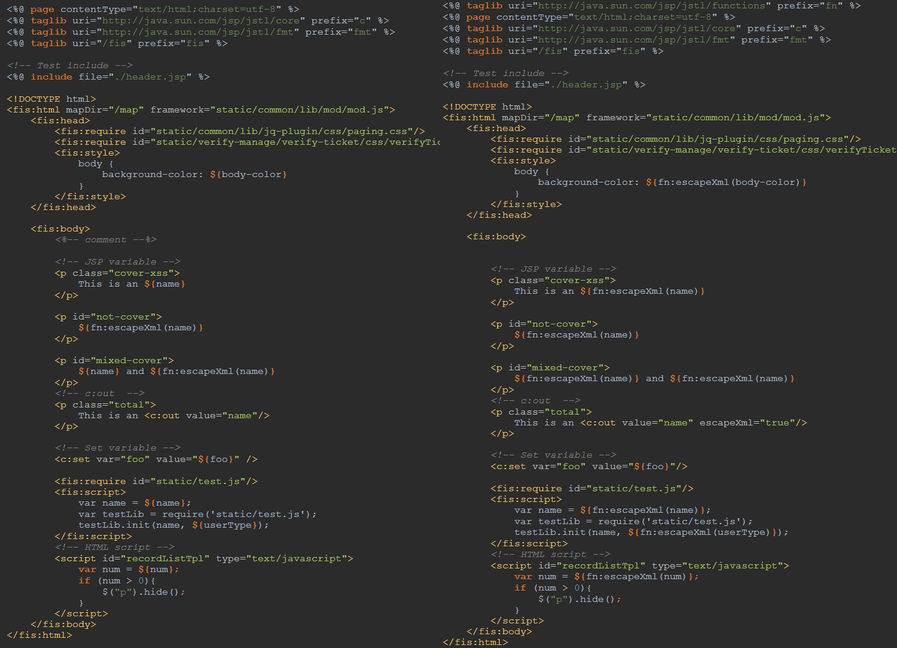

jello-optimizer-velocity-xss
====================
与FIS组@2betop发布的[*jello-optimizer-velocity-xss*](https://github.com/fex-team/jello-optimizer-velocity-xss)类似

自动将JSP**内容区**的变量加 `fn:escapeXml` 包裹，用于防止恶意代码执行。

另外，对于`<c:out>`标签强制加入属性`escapeXml="true"`




## 使用

安装

```bash
npm install -g jello-optimizer-jsp-xss
```

启用插件

```javascript
fis.config.set('modules.optimizer.vm', 'jsp-xss');

```

然后使用 release 命令的时候，记得带上 `-o` 参数。

```
jello release -o
```

## 配置项

*  `blacklist` 。数组格式，元素为正则对象,。用于规定哪些变量不转换。

```javascript
fis.config.set('settings.optimizer.velocity-xss', {
  blacklist: [
    /^foo/i, // foo 打头的变量不进行转换。
  ]
});
```

*  `cleanJspComments` 。布尔值。默认为true，即在编译时去除服务端注释<% ... %>。